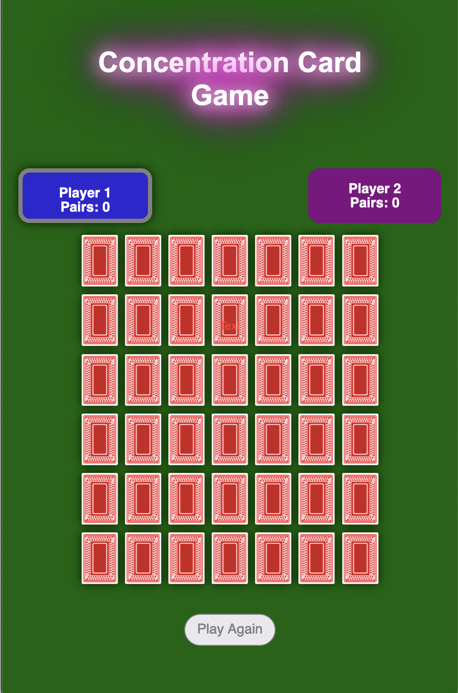

# Concentration Card Game 

Concentration is a round game in which all of the cards are laid face down on a surface and two cards are flipped face up over each turn. The object of the game is to turn over pairs of matching cards.

## Game Features:

- Simple and intuitive gameplay.
- Randomized card positions for each game session.

## How to Play:

- Click on cards to reveal their faces.
- Match pairs of cards with the same symbols.
- The game ends when all pairs are matched.

## Getting Started:

Click [here](https://mahshidmn.github.io/project1/) to play the game.

## Screenshot:

## Technologies Used:
- HTML
- CSS
- JavaScript